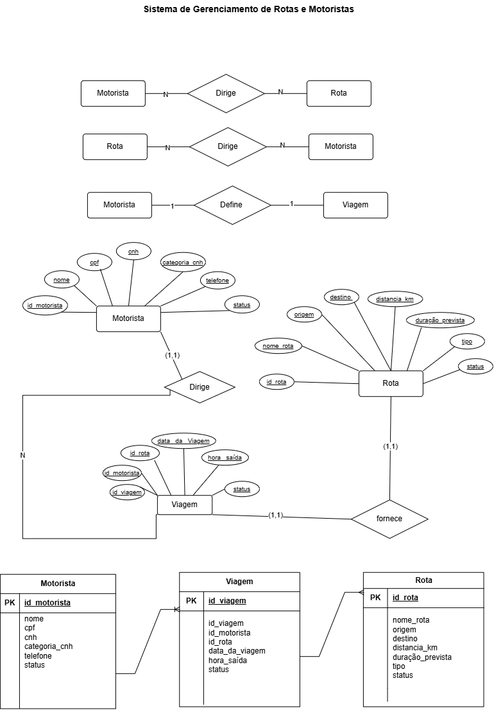

# Atividade_MER_DER

# Dicionário de Dados

| Entidade | Atributo | Tipo | Tamanho | Descrição |
|---|---|---|---|---|
| Motorista | `id_motorista` | `int` | `11` | Chave Primária |
| Motorista | `nome` | `varchar` | `100` | Nome completo do motorista |
| Motorista | `cpf` | `varchar` | `14` | CPF do motorista |
| Motorista | `cnh` | `varchar` | `11` | Número da CNH do motorista |
| Motorista | `categoria_cnh` | `varchar` | `2` | Categoria da CNH do motorista |
| Motorista | `telefone` | `varchar` | `15` | Telefone do motorista |
| Motorista | `status` | `varchar` | `20` | Situação atual do motorista |
| Rota | `id_rota` | `int` | `11` | Chave Primária |
| Rota | `nome_rota` | `varchar` | `100` | Nome ou identificação da rota |
| Rota | `origem` | `varchar` | `100` | Cidade de origem da rota |
| Rota | `destino` | `varchar` | `100` | Cidade de destino da rota |
| Rota | `distancia_km` | `decimal` | `6,2` | Distância da rota em quilômetros |
| Rota | `duracao_prevista` | `varchar` | `20` | Tempo previsto para realizar a rota |
| Rota | `tipo` | `varchar` | `20` | Tipo da rota |
| Rota | `status` | `varchar` | `20` | Situação atual da rota |
| Viagem | `id_viagem` | `int` | `11` | Chave Primária |
| Viagem | `id_motorista` | `int` | `11` | Chave Estrangeira que referencia o motorista |
| Viagem | `id_rota` | `int` | `11` | Chave Estrangeira que referencia a rota |
| Viagem | `data_viagem` | `date` | — | Data em que a viagem será realizada |
| Viagem | `hora_saida` | `time` | — | Horário de saída da viagem |
| Viagem | `hora_chegada` | `time` | — | Horário de chegada da viagem |
| Viagem | `status` | `varchar` | `20` | Situação atual da viagem |

#Código em CSV

[Motorista](https://github.com/Liviafmmm/bd_mer_der_aula02/blob/main/bcd-03ecxel.CSV)
[Rota](https://github.com/Liviafmmm/bd_mer_der_aula02/blob/main/bcd-04ecxel.CSV)
[Viagem](https://github.com/Liviafmmm/bd_mer_der_aula02/blob/main/bcd-022ecxel.CSV)
